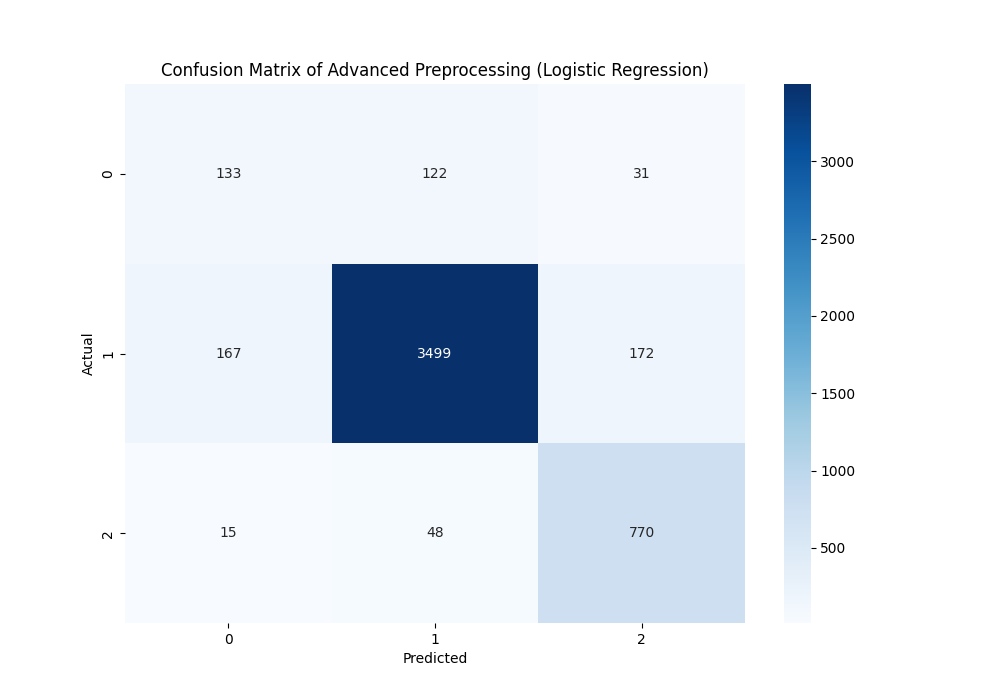
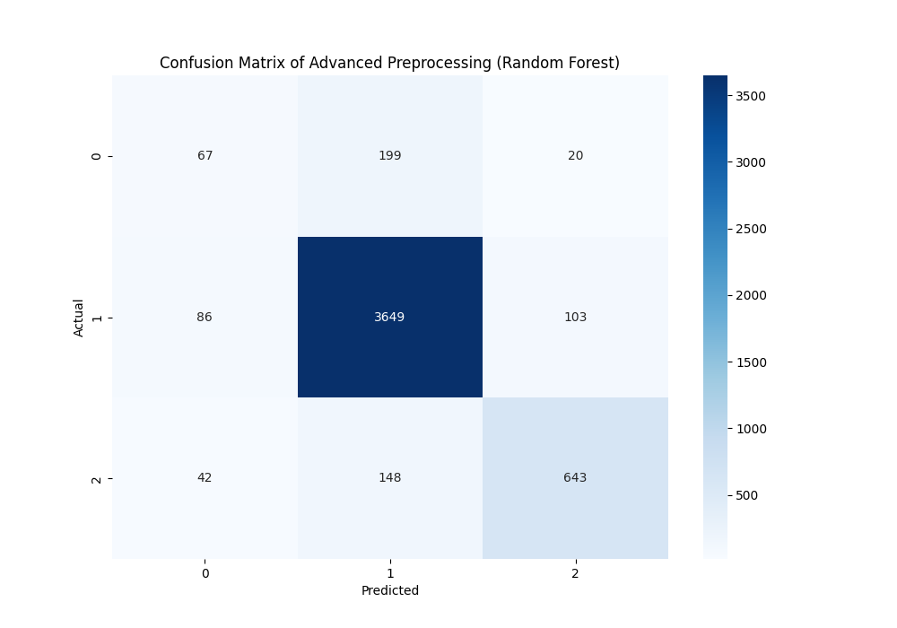
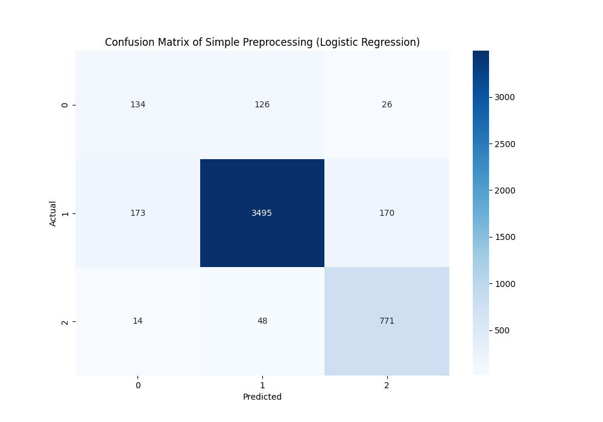
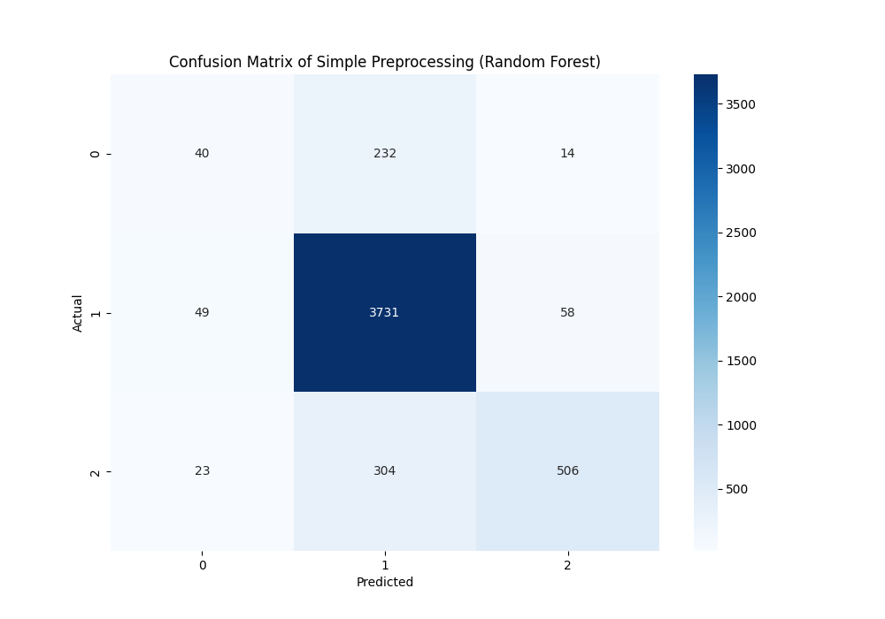

# Hate Speech and Offensive Language Dataset Analysis

This project demonstrates how to analyze and classify Hate Speech and Offensive Language dataset from Kaggle using a Jupyter Notebook.

## Project Overview
This project downloads the dataset from Kaggle, extract it, and perform basic data analysis using pandas. The dataset contains labeled data for hate speech and offensive language.
Here, I focused mainly on feature engineering for Natural Language Processing (NLP) and evaluating different machine learning models using confusion matrices.

## Preprocessing Steps
In this notebook, I performed two different preprocessing steps on the dataset:
- a simple preprocessing step: Lowercase the tweet, removal of URLs, HTML entities, hashtags and mentions, punctuation, and extra whitespace
- an advanced preprocessing step: Additional Tokenization, removal of Stopwords, and Lemmatization steps

## Requirements
- Python 3.x
- Jupyter Notebook
- Required Python packages:
  - `matplotlib`
  - `seaborn`
  - `scikit-learn`

## Classification 
This project trained a few Supervised Classifier, namely: MultinomialNB Model, Logistic Model, and a Random Forest model.

# Results: Confusion Matrices
Class 0 is hate speech, 
class 1 is offensive language, 
class 2 is neither.

 - Additional preprocessing steps does not necessarily lead to improved model performance (Tokenization, removal of Stopwords, and Lemmatization steps)
 - The logistic model performs better than the Random Forest model in detecting Hate Speech and Offensive Language
 - All three models fail to successfully classify tweets with hate speech, as I believe hate speech is harder to classify than offensive language due to its subtlety, reliance on context, cultural variability, and the need to interpret intent. Offensive language, while sometimes culturally sensitive, tends to be more direct and easier to detect.

<table>
  <tr>
    <td></td>
    <td></td>
  </tr>
  <tr>
    <td></td>
    <td></td>
  </tr>
</table>

## Acknowledgements
The [dataset](https://www.kaggle.com/datasets/mrmorj/hate-speech-and-offensive-language-dataset?resource=download) used in this project is provided by [mrmorj](https://www.kaggle.com/mrmorj) on Kaggle.
Thanks to Kaggle for providing the platform and API to access datasets.
